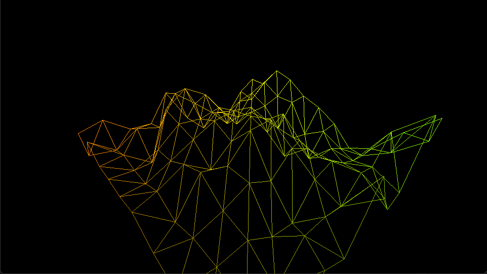
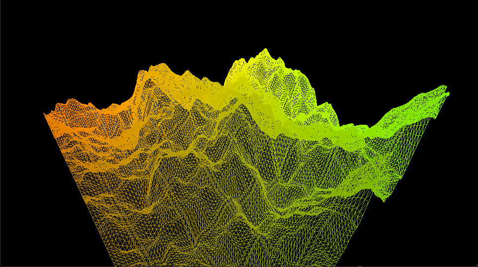

# Terrain  Generation

### About & Methodology
This project was programmed over the course of a week with the intention of deepening my understanding of the OpenGL graphics pipeline more specifically the tessellation stage. In order to explore the tessellation shader I created this simple project which uses both tessellation and fractal perlin noise in order to generate terrain.

The terrain generation works by generating a horizontal 2D grid mesh on the XZ plane. Next this data is sent to the GPU and the grid is sub-divided by a given amount via the uniform variable `divCount` (default value 16) in the tessellation control shader. The next step is in the tessellation evaluation shader where once the position of a vertex is set the y value (height) is determined via a Fractal Perlin Noise function.

### Example with tessellation disabled & enabled (16x)




## Dependencies
- CMake ≥3.25
- GLFW v3.4
- LibMath (personal math library)

## Inputs
User can move and look around via the WASD keys + mouse and E / Q keys for up & down.

## Running the Project
1. Clone this repository
2. In the project root, create a build folder
3. Open a terminal inside the `build/` folder
4. In the terminal run the following commands:
```
cmake ..
```

```
cmake --build .
```

5. Open the `.sln` file in the IDE of your choice (note the project has only been tested using Visual Studio 2022)
6. Press the run button